# TFTGLCDPanel

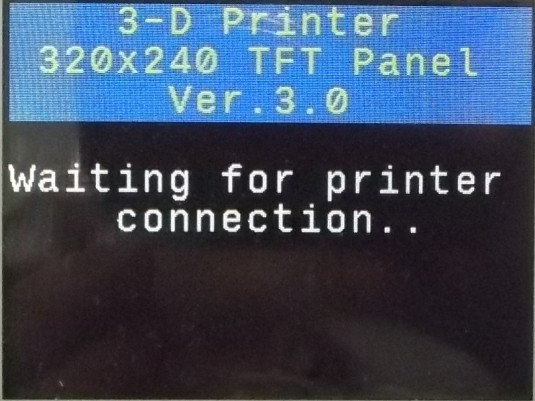
Start screen
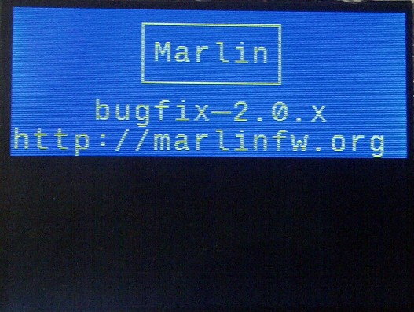
Marlin-2 logo
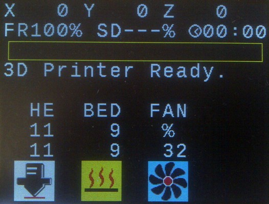
Status screen with 1 hotend and bed, Marlin
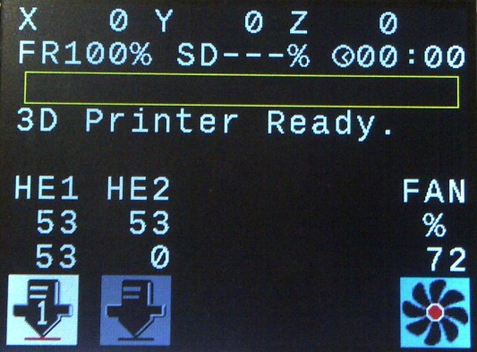
Status screen with 2 hotends, Marlin

Status screen with progressbar, Smoothieware
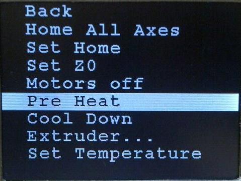
Menu, Smoothieware
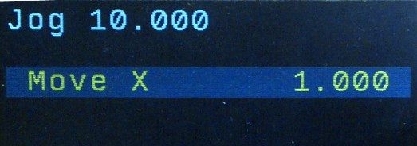
Edit parameter with encoder, Smoothieware
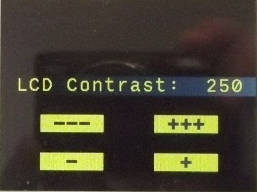
Edit parameter with touchscreen, Marlin
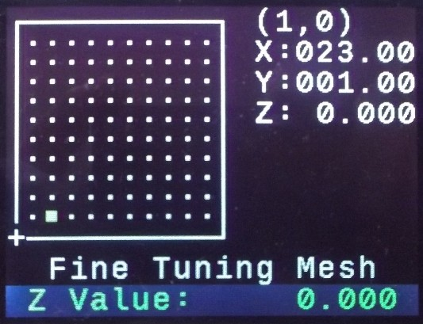
UBL: edit mesh with encoder
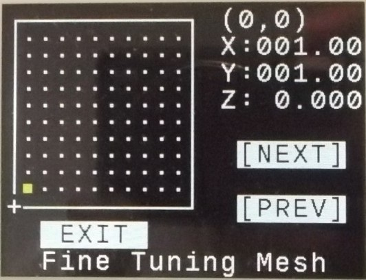
UBL: select point with touchscreen
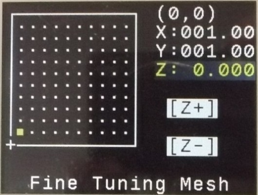
UBL: edit point with touchscreen
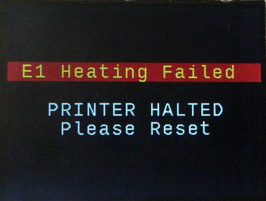
Error screen, Marlin
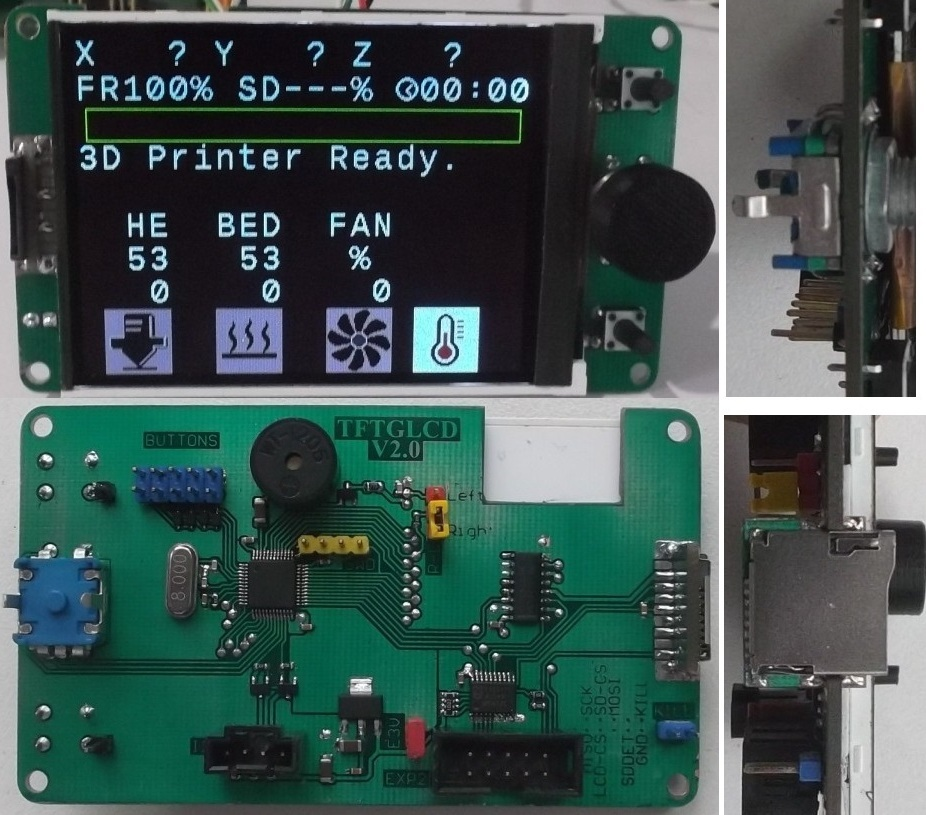
TFTGLCD panel V2 PCB
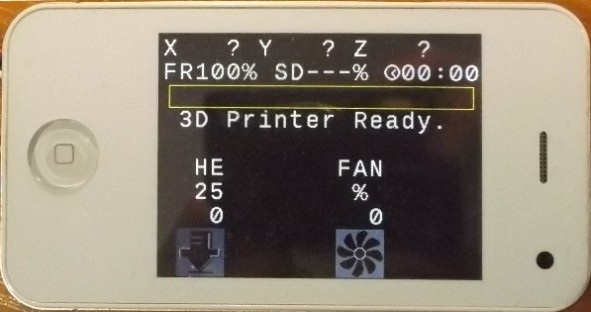
TFTGLCD panel V3 in case from chinese "mini Iphone"
