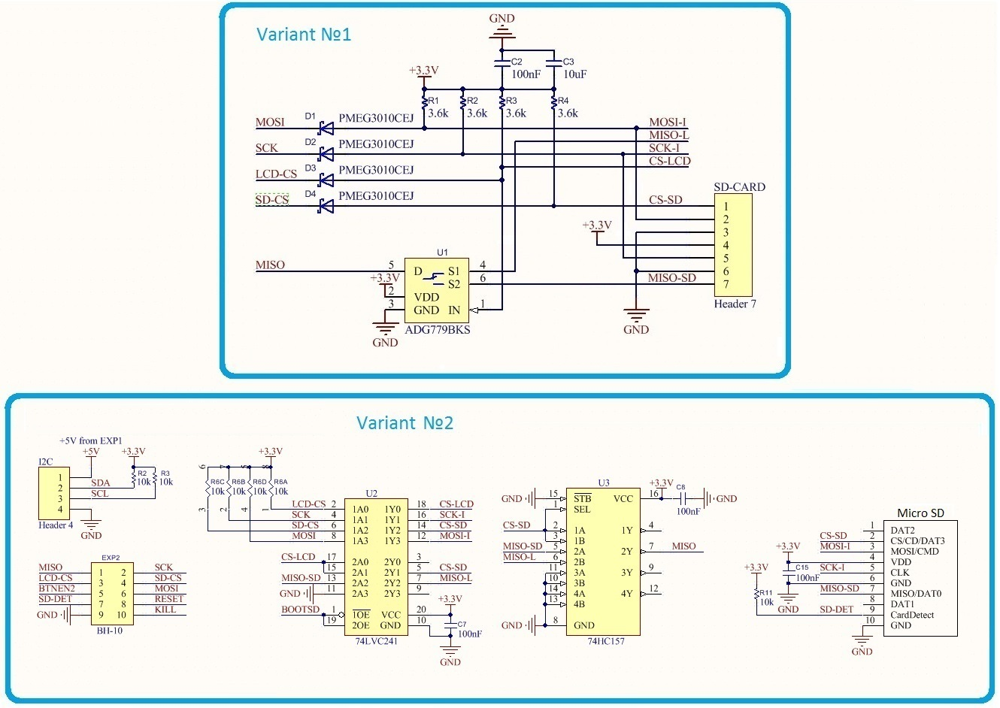

# TFTGLCDAdapter

## Connect to 5V boards
TFT GLCD Adapter developed to connect with main board by 3.3V SPI signals. If you want connect it to main board with 5V TTL-level signals (Arduino) you need add level converter for SPI input signals. This converter may be built on different schematic - with diodes and resistors or with microchips. On picture below you may see both variants. Also on this picture you may see level converter for I2C bus.

## Add SD support
If you want add SD-card support to TFT GLCD Adapter you need add multiplexer for MISO signal between panel MISO and SD-card MISO signals. This need because panel and SD-card share the same SPI bus. Two posible variants you may see on picture below.

