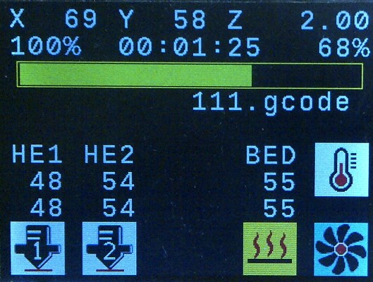
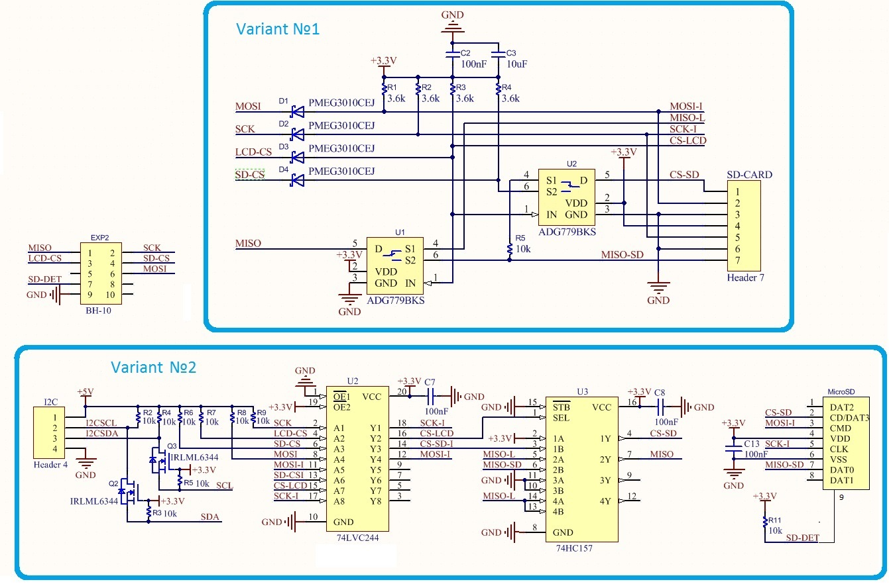

# TFTGLCDAdapter
TFT GLCD Adapter was developed as low cost replacement for monochrome LCDs with low resolution fonts. It works with Smoothieware, Marlin 1.1.9 and Marlin 2.0.x.

TFT GLCD Adapter based on STM32F103C8T6 "Blue Pill" board and color TFT GLCD on ILI9325 or ILI9341 chip with 320x240 resolution or ILI9327 chip  with 400x240 resolution. Also it has 1 encoder and 1 button, but you may set up to 6 buttons for Smoothieware and up to 3 buttons for Marlin, include encoder button.

Firmware for TFT GLCD Adapter created with CoIDE.

Hardware directory include pcb-project for this adapter created in Altium Designer and real photos.

Discussion about this TFT GLCD Adapter and my realization Smoothieboard you may find on https://www.radiokot.ru/forum/viewtopic.php?f=25&t=162580

## Using
To connect with Smoothieware TFT GLCD Adapter uses only SPI bus, for Marlin - SPI or I2C bus.

For use this adapter with Smoothieware you need:
* Compile Smoothieware firmware from https://github.com/Serhiy-K/Smoothieware/tree/add_new_panel.
* Set "panel.enable" parameter in **config** file to "true".
* Change "panel.lcd" parameter in **config** file to "tft_glcd_adapter".
* Set proper parameters for SPI bus.

For use this adapter with Marlin you need:
* Add/replace your Marlin's files with files from suitable archive in "For-Marlin" directory.
* Check TFTGLCD_ADAPTER section in **Conditionals_LCD.h** and recompile Marlin firmware.
* Read Readme.txt in "For-Marlin" directory for more details.

## Connect to 5V boards
TFT GLCD Adapter developed to connect with main board by 3.3V SPI signals. If you want connect it to main board with 5V TTL-level signals (Arduino) you need add level converter for SPI input signals. This converter may be built on different schematic - with diodes and resistors or with microchips. On picture below you may see both variants.

## Add SD support
If you want add SD-card support to TFT GLCD Adapter you need add multiplexer for MISO signal between panel MISO and SD-card MISO signals. This need because panel and SD-card share the same SPI bus. Two posible variants you may see on picture below.

Also you may change panel connector to standart EXP2 pinout.

